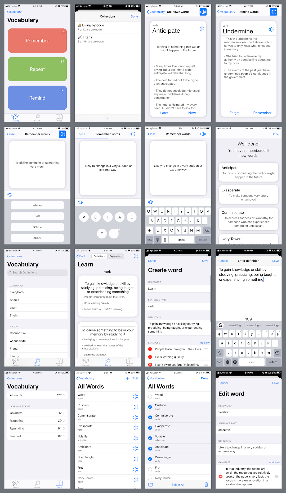

# Vocabulary
A simple app for learning English words by definitions loaded from [Merriam-Webster’s Learner’s Dictionary](https://www.dictionaryapi.com/products/api-learners-dictionary).

For more convenient testing the app has default data. 

## Abilities

* Search definitions
	* Showing words from clipboard and history
	* Add selected definition to learning
* Learning process
	* Learning types
		* Remember
		* Repeat
		* Remind
	* Questions types
		* Select headword
		* Construct from letters of a headword
		* Enter by keyboard
	* Word learning stages
		* Unknown
		* Repeating
		* Reminding
		* Learned
* Managing words
	* Add / Edit / Delete / Move to collection / Change learning stage
* Managing collections of words
	* Add / Delete / Rename
* Global
	* Word pronunciation
	* Undo management

